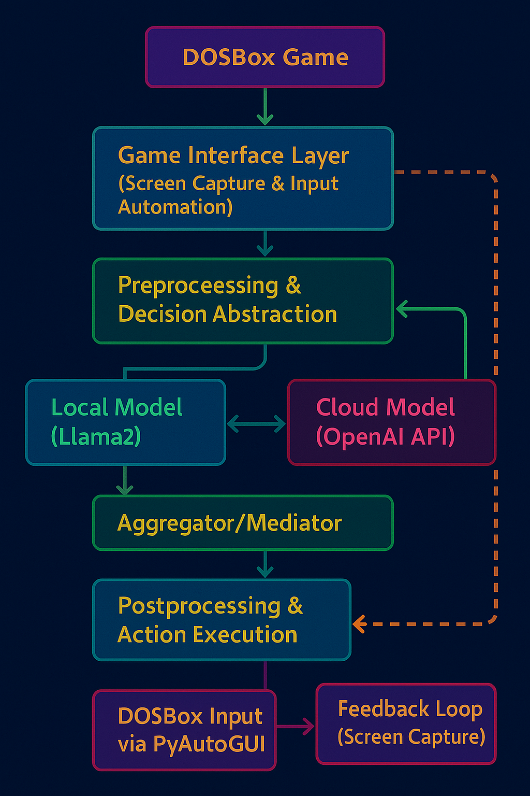

# **Can an AI master a 1996 strategy masterpiece?**

I'm combining modern AI models with retro gaming to push the boundaries of what autonomous agents can learn. My latest experiment involves training a hybrid AI system—powered by both a local Llama2 model and OpenAI’s GPT-3.5-turbo—to play *Master of Orion II*, the classic turn-based strategy game from MicroProse.

From screen capture and state extraction using OpenCV, to decision routing via a dual-model architecture, and command execution through simulated keystrokes—this is not just a passion project. It’s a technical deep dive into reinforcement learning, prompt engineering, game theory, and the limits of classical UI automation.

To visualize this setup, I created a systems diagram inspired by the *Master of Orion II* interface—complete with a retro sci-fi aesthetic. It maps out the full pipeline: from the game interface and screen capture to AI model routing, action execution, and feedback loops. Simple on the surface, but deeply layered under the hood.

The architecture is structured into six modular layers, following reported.

---

### 1. **Game Interface Layer**

- **Emulator Environment:** DOSBox (via Steam, running on Windows 11)  
- **Screen Capture:**  
  - `mss` or `Pillow` for raw frame capture  
  - `OpenCV` for image pre-processing (resizing, filtering, detection)  
- **Text Recognition (OCR):**  
  - `EasyOCR` or `Tesseract` for extracting structured game state (e.g. planet names, resource counts, diplomacy messages)

---

### 2. **Preprocessing & Decision Abstraction**

- **State Normalization:**  
  - Image regions of interest (ROIs) are cropped and passed through OCR/text classifiers.  
  - Outputs are structured into a JSON-like abstraction model representing:  
    ```json
    {
      "turn": 142,
      "resources": {
        "BC": 394,
        "Food": 12,
        "Research": 43
      },
      "event": "Antaran attack",
      "fleet": {
        "location": [5, 3],
        "status": "engaged"
      }
    }
    ```
- **Entity Mapping:**  
  - Visual markers are matched with known UI structures using OpenCV template matching or thresholding masks.

---

### 3. **AI Mediation & Hybrid Routing**

- **Routing Rules Engine:**  
  - Configurable logic selects either:
    - **Llama2 (local)**: Fast responses for deterministic or structured queries.
    - **GPT-3.5-turbo (API)**: Complex reasoning, diplomacy, long-term planning.
  - Fallback logic based on:
    - Latency thresholds
    - Task class (e.g. strategic vs UI-oriented)
    - Cost/availability constraints
- **Execution Models:**
  - Llama2 via `transformers` and `AutoModelForCausalLM`, CUDA-accelerated on RTX 3060
  - GPT-3.5 via `openai` Python SDK with prompt templates adapted to in-game language
- **Parallel Query Option (Experimental):**
  - Both models queried in parallel; outputs scored by task-specific heuristics or a voting classifier.

---

### 4. **Postprocessing & Action Execution**

- **Action Compiler:**  
  - Structured decisions are converted to high-level commands, such as:
    - `"click('Next Turn')"`  
    - `"drag_map_to(x=5, y=3)"`  
    - `"select_unit(index=2)"`  
- **Input Automation:**  
  - `PyAutoGUI` or `keyboard` libraries simulate DOSBox key/mouse input
  - Timed delays and image confirmation checkpoints (via OpenCV) for synchronization

---

### 5. **Feedback Loop**

- After executing a command, a new screen capture validates the state transition:
  - If the expected screen or state is not reached, an exception is logged and the last action may be retried or re-routed to GPT.
  - Used to verify command execution and iterate decision-making.

---

### 6. **Data Logging & Performance Monitoring**

- **Structured Logging:**  
  - Each cycle logs:
    - Timestamp  
    - Model used  
    - Action decision  
    - Game state snapshot (image + JSON)  
    - Success/failure
- **Performance Metrics:**  
  - Latency per layer  
  - Model confidence (if applicable)  
  - Game progression metrics (turns survived, victory conditions approached)
- **Analysis Pipelines (Planned):**  
  - Use `pandas` + `matplotlib` for replay and diagnostics  
  - Future: compare human vs AI sessions over same seed

---

## Architecture Diagram

> Inspired by Master of Orion II’s interface, this diagram illustrates the full pipeline from game capture to action execution.



---

## Technical Objectives

- Build an LLM-driven agent that can reason and act without direct memory access or emulator hacks.
- Benchmark local vs API models for action planning and UI interaction.
- Provide a reproducible system architecture for integrating AI into legacy closed-box software.

---

## Technologies Used

| Component                | Tool / Library                 |
|--------------------------|--------------------------------|
| Emulator & Game Runtime  | DOSBox via Steam               |
| Screen Capture           | `mss`, `Pillow`                |
| Image Processing         | `OpenCV`                       |
| OCR / Text Extraction    | `Tesseract`, `EasyOCR`         |
| Input Automation         | `PyAutoGUI`, `keyboard`        |
| Local AI Inference       | `transformers`, `Llama2`, CUDA |
| Cloud AI Inference       | `openai` (GPT-3.5 Turbo)       |
| Data Logging             | `logging`, `json`, `pandas`    |
| Visualization            | `matplotlib` (planned)         |


---

I'll soon open up task-specific modules as stand-alone tools (e.g. OCR tuning for pixel fonts, model routing logic, OpenCV UI parsers).

Stay tuned—and star the repo if you love classic strategy, AI engineering, or the mad science of making models play DOS games!

> This project is part of **#projectargonauti**

#AI #MachineLearning #RetroGaming #GameAI #Llama2 #GPT35 #StrategyGames #OpenSourceAI #TechInnovation #AIInGames #RetroTech #DigitalStrategy #NostalgiaMeetsInnovation #MachineLearningChallenges #projectargonauti
